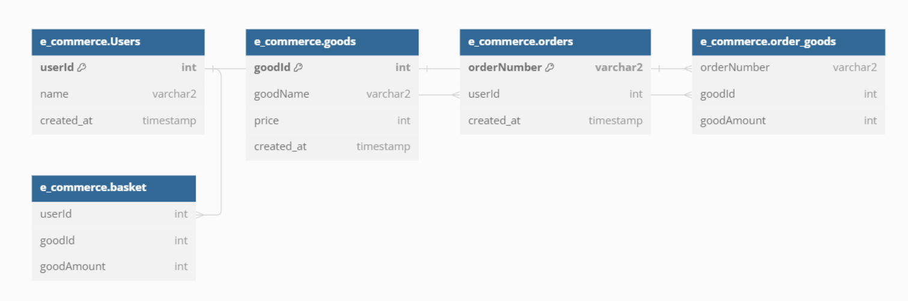

# 항해플러스 서버구축
## e-커머스 시나리오 선택
## 마일스톤
240330 - 시나리오 선정<br/>
240331 - 마일스톤 작성<br/>
240401 - 요구사항 분석<br/>
200402 - API 명세 작성<br/>
240403 - ERD 설계<br/>
240404 - MockAPI 작성 및 Github Repo 제출<br/>
## 요구사항 분석
- 상품 주문에 필요한 메뉴 정보들을 구성하고 조회가 가능해야 함
- 사용자는 상품을 여러개 선택해 주문할 수 있고 미리 충전한 잔액을 이용
- 상품 주문 내역을 통해 판매량이 가장 높은 상품을 추천
```yaml
- 잔액 충전
    - 사용자 식별자(id)를 확인해 잔액을 충전
- 잔액 조회
    - 사용자 식별자(id)를 확인해 잔액을 조회
- 상품 정보 조회
    - ID,이름,가격,잔여수량...
    - 조회시점의 상품별 잔여수량이 정확해야 함
- 주문
    - 사용자 식별자(ID), 상품ID, 수량을 입력받아야 함
    - 결제는 충전된 잔액을 사용, 결제 완료 시 잔액을 차감
    - 결제 성공 시 실시간으로 데이터 플랫폼에 전달
- 인기 상품 조회
    - 인기 상품 테이블 필요(?)
    - 테이블에 팔린 날짜 필요
- 장바구니
    - 사용자 식별자(id)를 장바구니 식별자로 사용(사용자1=장바구니1)
    - 사용자가 원하는 상품을 장바구니에 추가/삭제/조회 가능
        - 상품 추가 시 사용자 식별자(ID),상품ID, 수량 필요
        - 상품 삭제 시 사용자 식별자(ID),상품ID 필요
        - 상품 수량 조정 시 사용자 식별자(ID), 상품ID, 수량 필요
        - 조회 시 사용자 식별자(ID), 필요
```
## API 명세
### 잔액
#### 잔액 충전
##### 개요
ID와 충전량을 받아 잔액을 충전한다.
##### 엔드포인트
`PATCH /charge/{id}`
##### Request
###### 파라미터
|name       |type      | decription          |required|
|-----------|----------|---------------------|--------|
|id         |String    | 고유 식별자              |yes     |
|amount     |int       | 충전 할 금액             |yes     |
###### RequestBody
```json
{
    "amount": 10000
}
```
##### Response
- 200 OK: 충전 성공. 충전된 잔액을 반환
- 400 Bad Request: 파라미터가 옳지 않음
- 404 Not Found: 유저가 존재하지 않음
##### Error

---

#### 잔액조회
##### 개요
ID를 받아 현재 잔액을 조회한다.
##### 엔드포인트
`GET /charge/{id}`
##### Request
###### 파라미터
|name       |type      |decription          |required|
|-----------|----------|--------------------|--------|
|id         |String    |고유 식별자          |yes     |
##### Response
##### Error

---

### 상품
#### 상품 전체 조회
##### 개요
상품의 목록을 조회한다.
##### 엔드포인트
`GET /goods`
##### Request
##### Response
- 200 OK: 상품 목록 조회 성공. List 반환
##### Error

---

#### 상품 상세 조회
##### 개요
상품ID를 받아 상품을 상세 조회한다.
##### 엔드포인트
`GET /goods/{goodId}`
##### Request
###### 파라미터
|name       |type      |decription          |required|
|-----------|----------|--------------------|--------|
|goodId     |String    |상품 고유 식별자      |yes     |
##### Response
- 200 OK: 상품 상세 조회 성공. 상품DTO 객체 반환
- 404 Not Found: 상품을 찾을 수 없음
##### Error

---

#### 인기 상품 조회
##### 개요
최근 3일간 가장 많이 팔린 상위 5개 상품 정보를 조회한다.
##### 엔드포인트
`GET /goods/pop`
##### Request
##### Response
- 200 OK: 인기 상품 조회 성공.
##### Error

---

### 주문
#### 주문하기
##### 개요
ID를 받아 주문을 생성한다.
##### 엔드포인트
`POST /order/{id}`
##### Request
###### 파라미터
|name       |type      |decription          |required|
|-----------|----------|--------------------|--------|
|id         |String    |고유 식별자          |yes     |
###### RequestBody
```json
{
    "goodId": "123",
    "amount": 2
}
```
##### Response
- 201 Created: 주문 생성 성공.
- 400 Bad Request: 파라미터가 옳지 않음
- 404 Not Found: id가 존재하지 않음
##### Error


### 장바구니(나중에 고려)
- GET /basket/{id} 장바구니 전체 조회 ->  List
- POST /basket/{id}/{goodId} 상품 추가
- DELETE /basket/{id} 전체 상품 삭제
- DELETE /basket/{id}/{goodId} 해당 상품 삭제


## ERD
