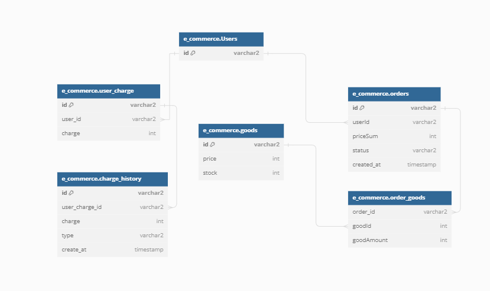

# 항해플러스 서버구축
## e-커머스 시나리오 선택

## 마일스톤
240330 - 시나리오 선정<br/>
240331 - 마일스톤 작성<br/>
240401 - 요구사항 분석<br/>
200402 - API 명세 작성<br/>
240403 - ERD 설계<br/>
240404 - MockAPI 작성 및 Github Repo 제출<br/>

## 요구사항 분석
- 상품 주문에 필요한 메뉴 정보들을 구성하고 조회가 가능해야 함
- 사용자는 상품을 여러개 선택해 주문할 수 있고 미리 충전한 잔액을 이용
- 상품 주문 내역을 통해 판매량이 가장 높은 상품을 추천
```yaml
- 잔액 충전
    - 사용자 식별자(id)를 확인해 잔액을 충전
- 잔액 조회
    - 사용자 식별자(id)를 확인해 잔액을 조회
- 상품 정보 조회
    - ID,이름,가격,잔여수량...
    - 조회시점의 상품별 잔여수량이 정확해야 함
- 주문
    - 사용자 식별자(ID), 상품ID, 수량을 입력받아야 함
    - 결제는 충전된 잔액을 사용, 결제 완료 시 잔액을 차감
    - 결제 성공 시 실시간으로 데이터 플랫폼에 전달
- 인기 상품 조회
    - 인기 상품 테이블 필요(?)
    - 테이블에 팔린 날짜 필요
- 장바구니
    - 사용자 식별자(id)를 장바구니 식별자로 사용(사용자1=장바구니1)
    - 사용자가 원하는 상품을 장바구니에 추가/삭제/조회 가능
        - 상품 추가 시 사용자 식별자(ID),상품ID, 수량 필요
        - 상품 삭제 시 사용자 식별자(ID),상품ID 필요
        - 상품 수량 조정 시 사용자 식별자(ID), 상품ID, 수량 필요
        - 조회 시 사용자 식별자(ID), 필요
```

## API 명세
docs 디렉토리 확인

### 장바구니(나중에 고려)
- GET /basket/{id} 장바구니 전체 조회 ->  List
- POST /basket/{id}/{goodId} 상품 추가
- DELETE /basket/{id} 전체 상품 삭제
- DELETE /basket/{id}/{goodId} 해당 상품 삭제

## 플로우 차트


## ERD

