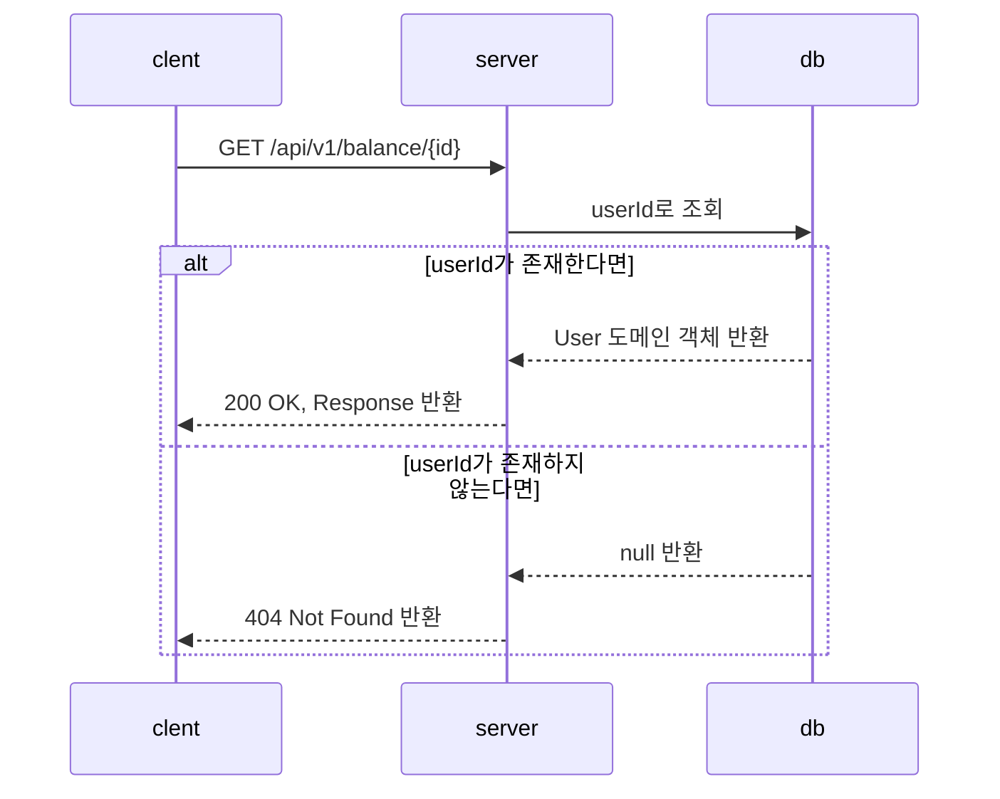
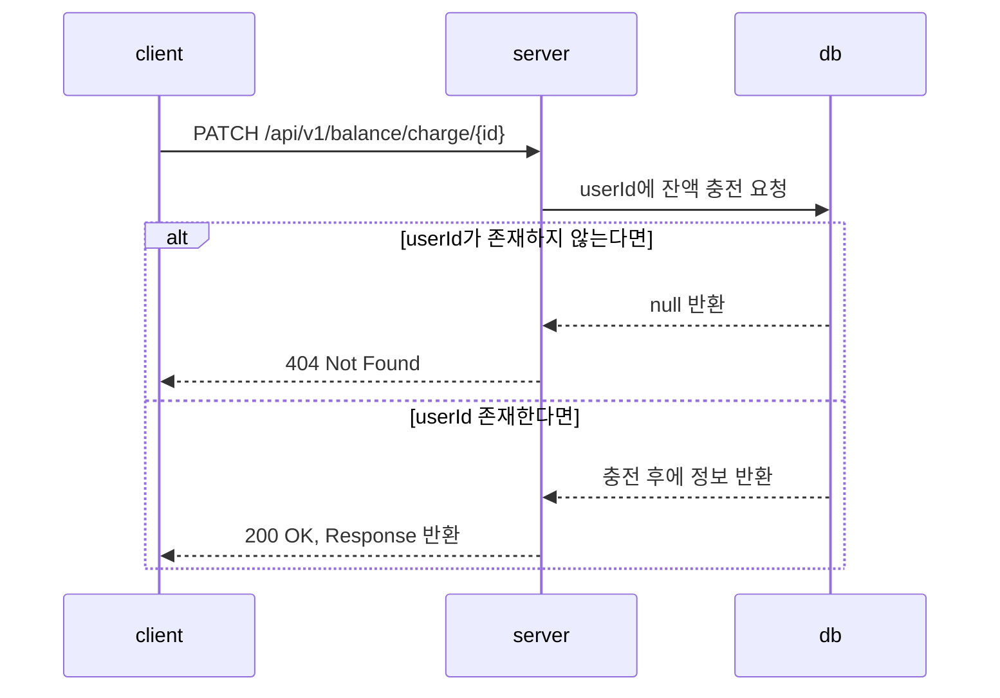

# 잔액 API
## 잔액 조회
userId를 전달 해 현재 잔액을 확인한다.
### 시퀀스 다이어그램

### 요청
- 메서드: GET
- URL: /api/v1/balance/{id}
- Header:
    - Content-Type: application/json
### 응답
- 200 OK: 잔액 조회 성공
    ```json
  {
    "meta": {
      "status": "OK",
      "total_count": 1
    },
    "body": {
      "userId": "id",
      "balance": 1,
      "message": "Successful"
    }
  }
    ```
- 404 Not Found: 유저 조회 실패
    ```json
  {
    "meta": {
      "status": "Not Found"
  },
    "body": {
      "message": "User ID doesn't exist"
    }
  }
  ```

## 잔액 충전
userId를 전달 해 현재 잔액을 충전한다.
### 시퀀스 다이어그램

### 요청
- 메서드: PATCH
- URL: /api/v1/balance/charge/{id}
- Header: 
    - Content-Type: application/json
- Body:
    ```json
      {
        "amount": 1
      }
    ```
### 응답
- 200 OK: 잔액 충전 완료
    ```json
    {
    "meta": {
      "status": "OK",
      "total_count": 1
    },
    "body":{
      "userId": "id",
      "balance": 1
    }
  } 
    ```
- 404 Not Found: ID 찾을 수 없음
    ```json
    {
      "meta": {
        "status": "Not Found"
      },
      "body": {
        "message": "User ID doesn't exist"
      }
    }
    ```
