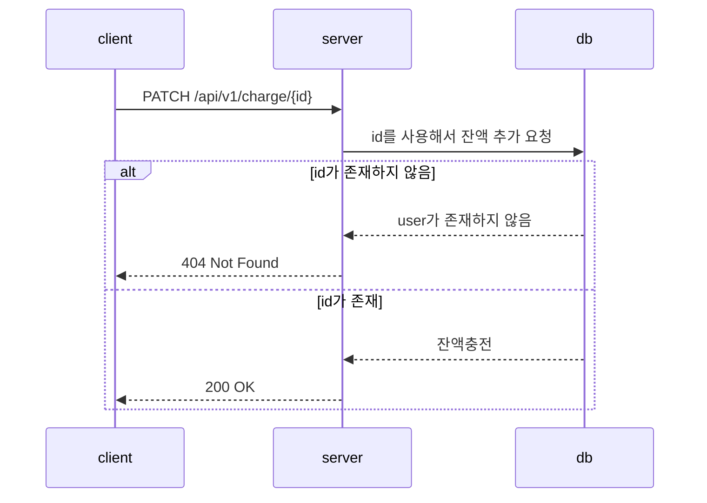
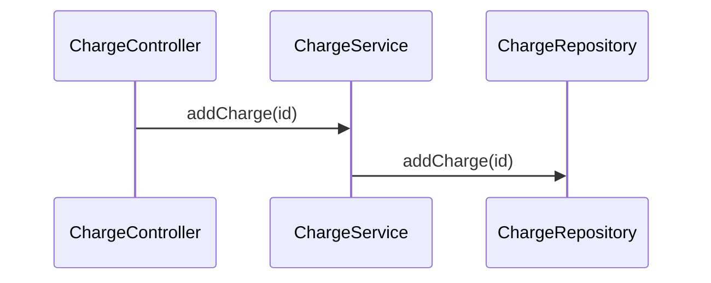

# 잔액 API
## 잔액 조회
### 기본정보
- 개요
    - 잔액을 조회합니다. URL로 ID를 받습니다.
- 메서드 - GET
- URL - `GET /charge/{id}`
### 요청
- 헤더:
    
### 응답
- 200 OK 성공적으로 조회된 경우
```json
{
  "meta": {
    "status": "OK",
    "total_count": 1
  },
  "body": [
      {
      "userId": "id",
      "charge": 1,
      "message": "Successful"
    }
  ]
}
```
- 404 Not Found 유저 id가 존재하지 않는 경우
```json
{
  "meta": {
    "status": "Not Found"
  },
  "body": {
    "message": "User ID doesn't exist"
  }
}
```
## 잔액 충전
### 기본정보
- 개요
    - ID와 충전량을 받아 잔액을 충전합니다.
- 메서드 - PATCH
- URL - `PATCH /charge/{id}`



### 요청
- 헤더:
    - Content-Type: application/json
- 본문:
```json
{
  "amount": 20000
}
```
### 응답
- 200 OK 성공적으로 충전 된 경우
```json
{
  "meta": {
    "status": "OK",
    "total_count": 1
  },
  "body": [
      {
      "userId": "id",
      "charge": 20000,
      "message": "Successful"
    }
  ]
}
```
- 400 Bad Request 충전 금액이 옳지 않음
```json
{
  "meta": {
    "status": "Bad Request"
  },
  "body": {
    "message": "The charge amount is incorrect"
  }
}
```
- 404 Not Found 유저 id가 존재하지 않는 경우
```json
{
  "meta": {
    "status": "Not Found"
  },
  "body": {
    "message": "User ID doesn't exist"
  }
}
```