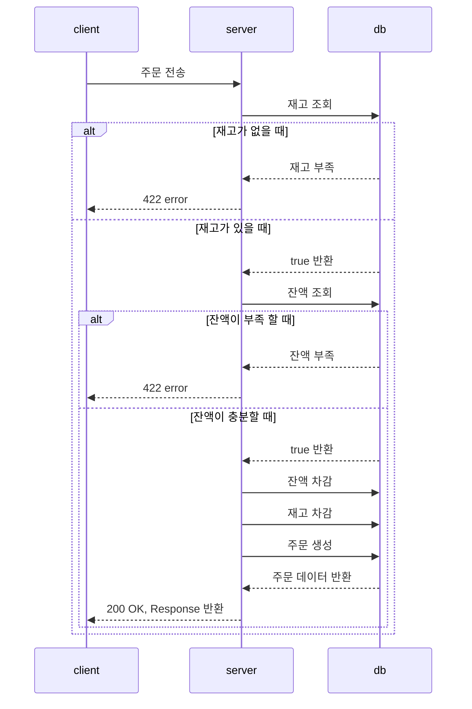

# 주문 API
## 주문
### 시퀀스 다이어그램

### 요청
- 메서드: POST
- URL: /api/v1/order
- Header
    - Content-Type: application/json
- body:
    ```json
    {
      "total_count": 2,
      "products": [
        {"productId": "id", "quantity": 1},
        {"productId": "id", "quantity": 1}
      ]
    }
  ```
### 응답
- 200 OK: 주문이 생성 됐을 때
    ```json
  {
    "meta": {
      "status": "OK"
    },
    "body": {
      "orderId": "id",
      "userId": "id"
    }
  }
    ```