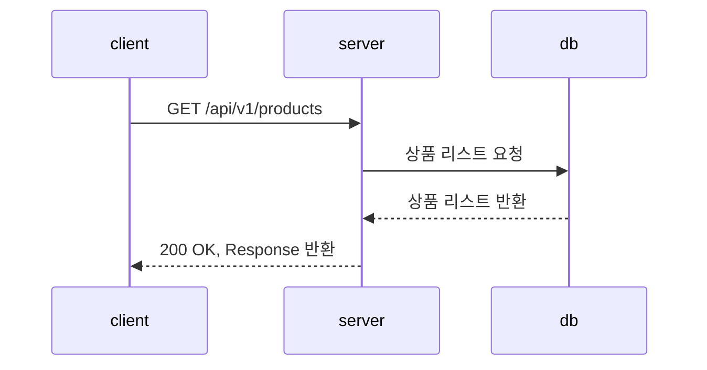
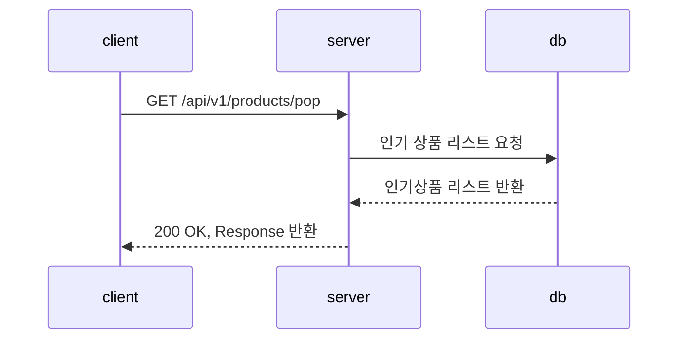

# 상품 API
## 상품 조회 
### 시퀀스 다이어그램

```mermaid
sequenceDiagram
    participant c as client
    participant s as server
    participant d as db
    c ->> s: GET /api/v1/products
    s ->> d: 상품 리스트 요청
    d -->> s: 상품 리스트 반환
    s -->> c: 200 OK, Response 반환
```
### 요청
- 메서드: GET
- URL: /api/v1/products
- Header
  - Content-Type: application/json
### 응답

## 인기 상품 조회
### 시퀀스 다이어그램

```mermaid
sequenceDiagram
    participant c as client
    participant s as server
    participant d as db
    c ->> s: GET /api/v1/products/pop
    s ->> d: 인기 상품 리스트 요청
    d -->> s: 인기상품 리스트 반환
    s -->> c: 200 OK, Response 반환
```
### 요청

### 응답